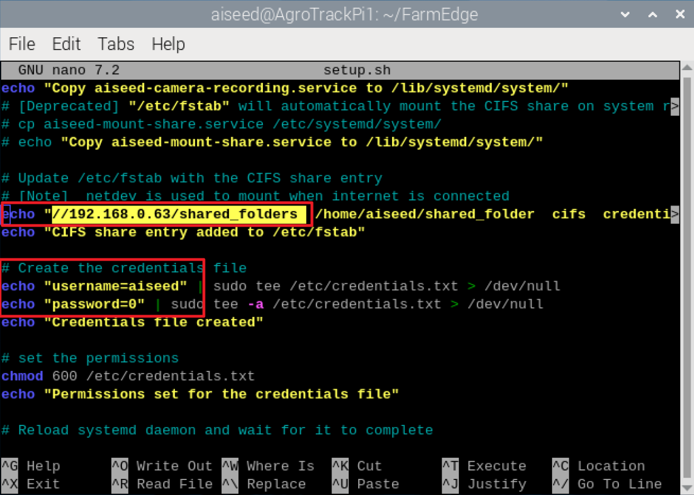
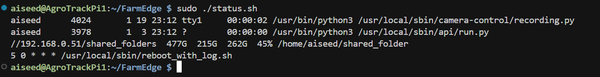
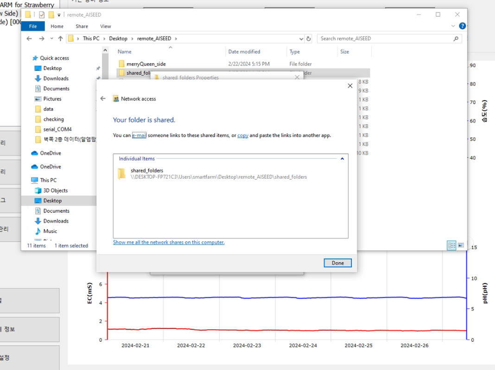

# FarmEdge


Services run on Edge devices, to:
- Capture images from the cameras by regular intervals `camera-control/recording.py`
- Send the images to the main server for savings
- Provide an API for the main server: `api/run.py`
  - To query the status of the edge devices
  - To stream the camera feed (real-time)


To get detail check: [Development Notes](#development-notes)
## Installation
Before installing the services on the edge devices, make sure setting up the  [shared folder on the host PC](#1-setting-up-the-shared-folder-on-the-host-pc) that will be mounted on the edge devices. 
1. Automatic installation the flask service and camera service on each pi by running the setup.sh script as root (Last Checked: 2025-JUN-26, by HZ)
     1. Open `FarmEdge/setup.sh` as nano
        ```bash
        nano setup.sh
        ```

     2. Change smb/cifs information of host PC and save (around line number 31)
        * username = aiseed or linux
        

     3. Open and Change `FarmEdge/camera-control/config.yaml` as nano
        ```bash
        nano camera-control/config.yaml
        ```
        

     4. run `FarmEdge/setup.sh` as root
        ```bash
        sudo ./setup.sh
        ```
     5. (To check running)
        ```bash
        sudo ./status.sh
        ```
        

     5. (Uninstallation or Update)
        To update, uninstall first and run setup.sh again.
        ```bash
        sudo ./uninstall.sh
        ```
        After uninstall, the backup of configuration is saved to home folder
        
        


2. Setting up the services manually (we're doing this approach) :
     1. Install `cifs-utils` to mount the shared folder.
   ```bash
   sudo apt-get install cifs-utils
   ```
   2. Mounting the shared folder : 
   ```bash
   sudo mount.cifs -o username=aiseed,uid=aiseed,gid=aiseed //192.168.0.63/shared_folders /home/aiseed/shared_folder
    ```
   
  
   3. Starting the services (`flask and camera`) by running the `run.sh` script

---
## Setup Host PC
- **Shared folder on the host PC that will be mounted on the edge devices**
- **Remote access from the host PC to Edge devices via `local network`**

### 1. Setting up the shared folder on the host PC
- **Host PC** (Windows): The host PC is opened a shared folder.
    - Step 1: Right-click on the folder you want to share and select `Properties`.
    - Step 2: Click on the `Sharing` tab and then click on `Share`.
      
         -  
    - Step 3: Select the user with whom you want to share the folder and click on `Add`. Then click on `Share`. Note: We
      should create new User Windows to be separated purpose
      -  
        
    - Step 4: Click on `Done`.

        - 
      
---
## Development Notes


### 1. Idea

#### Short Claim: The idea is to have a service that runs on each edge device that can be queried by the main server to get the status of the device (**SERVER**)

- `setup.sh` script:
    - installing all the required packages
    - copying the service file to the systemd directory
    - enabling and starting the service (with this script, the service will start on boot)
- `aiseed-edge-api.service`: executing the `run.py` script (aka starting the Flask API):
  - `'/api/video_feed/<int:camera_id>'` endpoint to stream the camera feed
  - `'/api/cache_time'` endpoint to get the status of the edge devices (by checking the `last_time.txt` file)
- `aiseed-camera-recoding.service`: executing the `recording.py` script to capture the photo and save it to the main
  server. The interval time is set in the `config.yaml` file and using a text file `last_time.txt` to keep track of the last time the photo was taken.
- `aiseed-mount-share.service`: mounting the shared folder from the main server to the edge devices

### 2. Script for Testing:

- `sudo netstat -tulpn | grep LISTEN`: check if the Flask service is running
- `sudo nano /etc/fstab`: check if the shared folder is mounted (possible to be written in many times)
- Remove the services before running the script again, example:
    - `sudo systemctl stop aiseed-edge-api.service`
    - `sudo systemctl disable aiseed-edge-api.service`
    - `sudo remove /etc/systemd/system/aiseed-edge-api.service`

#### @Copyright 2024 Andrew Lee - All Rights Reserved
