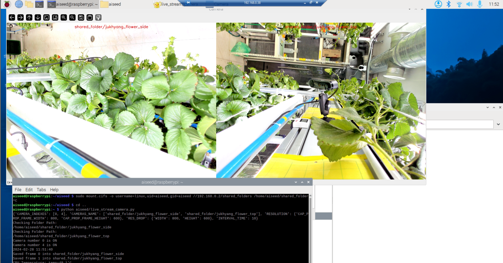

# 1. Microsoft Remote Desktop on Host PC

- Using `Windows + R` to open the `Run` dialog box, then type `mstsc` to open the `Remote Desktop Connection` window.
  Enter the Raspberry Pi IP address and click `Connect`.
- Using [`remoteAccess.bat`](hostPC/remoteAccess.bat) file to open the `Remote Desktop Connection` window.


# 2. Displaying Multiple Cameras

This project contains scripts for handling multiple cameras using OpenCV in Python.



## Files

- `open_multiple_camera.py`: Opening multiple cameras, checks their status, and handles errors such as camera
  disconnection. It also saves images at regular intervals and displays the CPU temperature.
- `list_all_camera_ON.py`: lists all the cameras that are currently ON.
  or excute `v4l2-ctl --list-devices` (find the supported webcam resolutions)
- `check_single_camera.py`: checks the status of a single camera and display.

### Explain Code

#### 1. **Configuration** in `open_multiple_camera.py`

- Contains a configuration section in the form of a YAML file. This allows easy control over various parameters such as
the resolution, number of cameras, and interval time.

```python
# YAML Configuration
# This is a YAML configuration file for the camera settings.

# CAMERA_INDEXES:
# List of indexes for the cameras to be used.
# Each index corresponds to a specific camera.
# For example, 0 might correspond to the first camera, 4 to the second, etc.
# In this case, we are using the cameras at index 0 and 4.
- 0
- 4

# CAMERAS_NAME:
# List of names for the cameras.
# These names correspond to the shared folders where the images from each camera will be saved.
# In this case, the images from the first camera will be saved in "shared_folder/merryQueen_floor_2"
# and the images from the second camera will be saved in "shared_folder/merryQueen_floor_3".
- "shared_folder/merryQueen_floor_2"
- "shared_folder/merryQueen_floor_3"

# RESOLUTION:
# The resolution settings for the cameras.
# CAP_PROP_FRAME_WIDTH and CAP_PROP_FRAME_HEIGHT are the width and height (in pixels) of the frames captured by the cameras.
# In this case, the cameras will capture frames of size 800x600 pixels.
CAP_PROP_FRAME_WIDTH: 800
CAP_PROP_FRAME_HEIGHT: 600

# RES_DROP:
# The resolution settings for the camera grid display.
# WIDTH and HEIGHT are the width and height (in pixels) of the frames displayed in the camera grid.
# In this case, the camera grid will display frames of size 800x600 pixels.
WIDTH: 800
HEIGHT: 600

# INTERVAL_TIME:
# The interval time (in minutes) at which the cameras will capture images.
# In this case, the cameras will capture an image every 10 minutes.
INTERVAL_TIME: 10
```

- Note: In `open_multiple_camera.py` file, make sure to change the path to the shared folder in 'config' correctly.
  ```python
  config_data = """
  ...
  CAMERAS_NAME:
  - "/home/aiseed/shared_folder/camera_0"
  - "/home/aiseed/shared_folder/camera_1"
  ...
    """
    ```

#### 2. **List of functions** in `open_multiple_camera.py`
- **Automatic Folder Creation**: automatically creates a separate folder for each camera. This helps in organizing the
images captured from each camera.
- **Layout Creation**: creates a layout of Nx2, where N is the number of cameras. This layout is used to display the feed
from all the cameras.
  ```python
  def create_layout(frames, config):
      """
      Create a nx2 frame with two cameras for each row. If number of camera is odd then create a blank frame
      """
      num_of_cams = len(config["CAMERA_INDEXES"])
      layout_rows = np.ceil(num_of_cams / 2)
      ...
      return layout
  ```
- **Camera Error Handling**: handles camera errors effectively. If a camera loses connection, its feed in the layout
   turns black and a notification is displayed.
  ```python
  def generate_error_error_frame(config, message):
      # Generate a Black frame with error message
      ...
  return error_frame
  ```
- **Image Capture**: captures and saves images from each camera at regular intervals. The interval time can be set in
   the configuration.

#### @Copyright 2024 Andrew Lee - All Rights Reserved